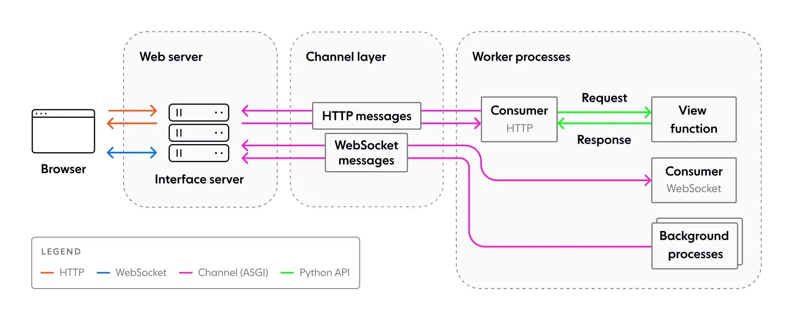
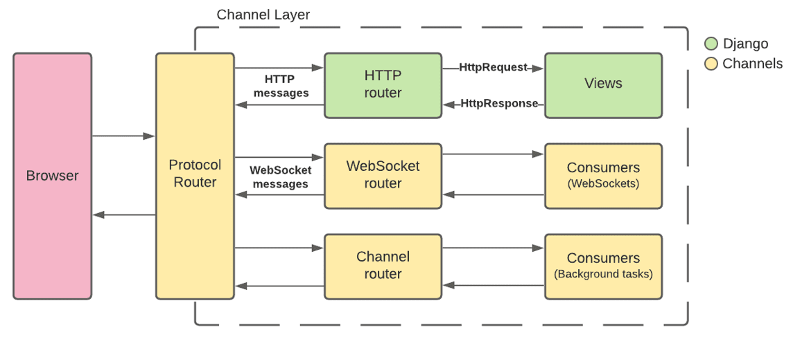
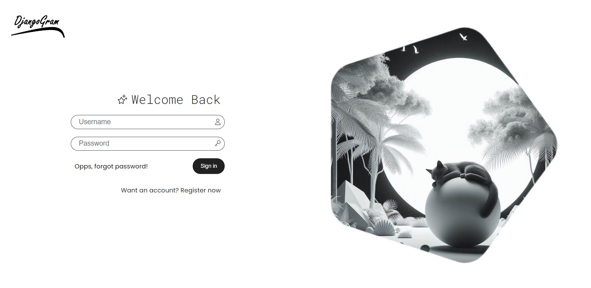
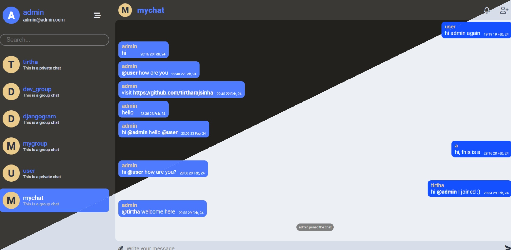

# Djangogram

A simple chat applicatio built using django, django-chennels, redis and postgresDB

## How to Run [docker]

```
docker compose up --build
```

## ondevelopment environment run the build command and this command simultaneously on diffrent terminal

```
docker compose watch
```

## docker images used

1. alpine
2. postgres
3. redis
4. ngrok
   \*\* configuere ngrok in ngrok.yml. follow [docs](https://ngrok.com/docs/agent/config/#tunnel-configurations)

```
## ngrok.yml

version: "2"
authtoken: <YOUR NGROK AUTH TOKEN>
tunnels:
  httpbin:
    proto: http
    addr: web:8000
    domain: <YOUR STATIC DOMAIN>

```

## chat delevery workflow




## Screenshots



